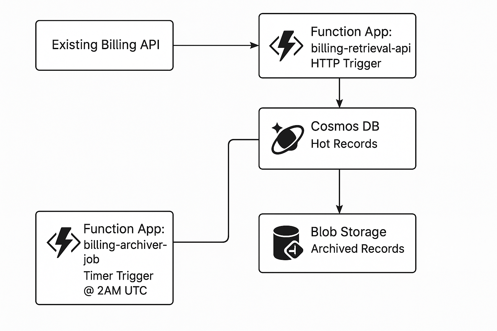

# Azure DevOps Assignment – Symplique

This repository demonstrates a serverless, scalable, and cost-effective archival and retrieval solution for billing records stored in Azure Cosmos DB. It uses **Azure Functions**, **Azure Blob Storage**, and **Terraform** for infrastructure automation.

---

## 📌 Problem Statement

The objective was to reduce costs and improve data lifecycle management for a Cosmos DB-based billing system storing millions of records.

> 📄 [View the full problem statement here](https://gist.github.com/vikas-t/724da4a118612a8a8faf0acd5e4e4567)

Key requirements included:

- Archiving records older than 90 days to Azure Blob Storage.
- Preserving API behavior without any breaking changes.
- Ensuring zero downtime.
- Automating deployment with Infrastructure as Code (IaC).

---

## 🏗️ Architecture Overview



The architecture comprises two main Azure Functions:

- [`billing_records_archival`](azure-functions/billing_records_archival/)  
  Scheduled function that moves data older than 90 days from Cosmos DB to Blob Storage.

- [`billing_records_retrieval`](azure-functions/billing_records_retrieval/)  
  On-demand retrieval function that queries Cosmos DB or falls back to Blob Storage if the record is archived.

Infrastructure is provisioned using [Terraform](terraform/).

More details available in [docs/new_architecture.md](docs/new_architecture.md).

---

## 📁 Project Structure

```text
azure-devops-assignment-symplique/
├── azure-functions/
│   ├── billing_records_archival/
│   └── billing_records_retrieval/
├── docs/
│   ├── new_architecture.md
│   └── new_architecture.png
├── terraform/
│   ├── main.tf
│   ├── variables.tf
│   └── outputs.tf
├── README.md
└── chatgpt-prompt.md
```

---

## 🧰 Technologies Used

- Azure Functions (Python)
- Azure Blob Storage
- Azure Cosmos DB
- Azure Storage Account
- Terraform (AzureRM Provider)
- Python 3.10+

---

## 🚀 Getting Started
###✅ Prerequisites
- Azure CLI (az login)
- Terraform v1.0+
- Python 3.10 with Azure Functions Core Tools

---

## 🛠️ Infrastructure Deployment
```bash
cd terraform
terraform init
terraform plan
terraform apply
```
> Make sure to configure `backend` and other environment-specific variables.

---

## ⚙️ Azure Functions Deployment
Install dependencies and publish:
```bash
cd azure-functions/billing_records_archival
pip install -r requirements.txt
func azure functionapp publish <your-function-app-name>
```
Repeat the same for billing_records_retrieval.

---

### 🧪 Example Usage
- **Archival**: Triggered by a time-based schedule.
- **Retrieval**: Queries Cosmos DB; if the record is archived, fetches from Blob Storage.
- Input/output formats can be defined in each function's README.

---

## 📈 Monitoring & Observability
> Planned for future enhancement.
- Integrate with Azure Monitor and Application Insights.
- Add custom logging and metrics.

---

## ✅ To-Do / Enhancements
- Add CI/CD pipeline (e.g., GitHub Actions or Azure Pipelines)
- Improve error handling & retry policies
- Parameterize archival threshold
