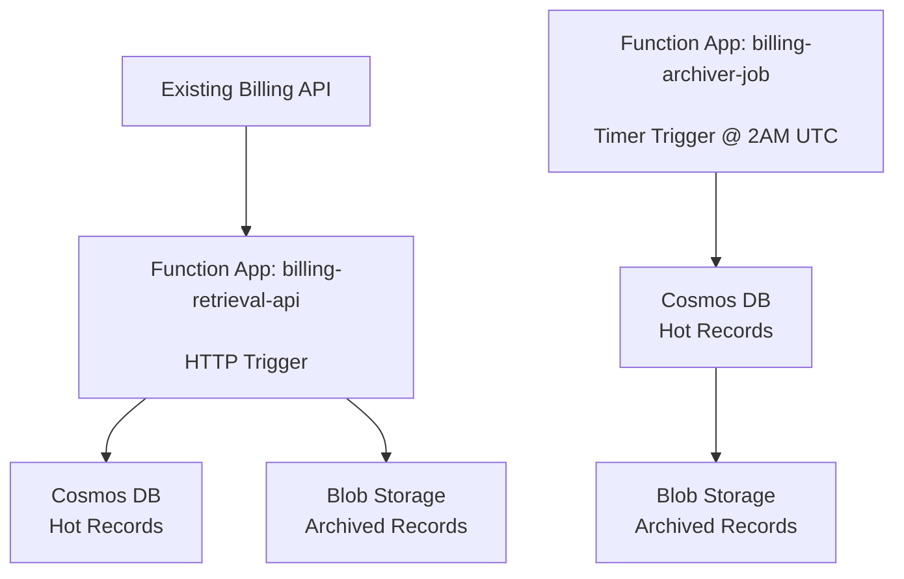

```mermaid
graph TD;
  A[Existing Billing API] --> B[Function App: billing-retrieval-api<br/><br/>HTTP Trigger];
  B --> C[Cosmos DB<br/>Hot Records];
  B --> D[Blob Storage<br/>Archived Records];

  E[Function App: billing-archiver-job<br/><br/>Timer Trigger @ 2AM UTC] --> F[Cosmos DB<br/>Hot Records];
  F --> G[Blob Storage<br/>Archived Records];
```